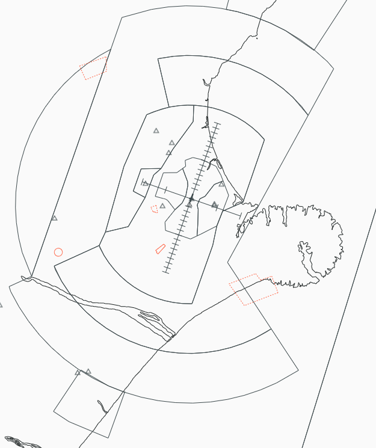

--8<-- "includes/abbreviations.md"

!!! note "Christchurch Procedures"
    The CTMA procedures build upon information already contained in the [NZCH Aerodrome Procedures](../aerodromes/Class-C/nzch.md), and any Controller logged on to CTMA should be familiar with those procedures.

## Positions

| Position Name     | Shortcode | Callsign              | Frequency | Login ID | Usage     |
| ----------------- | --------- | --------------------- | --------- | -------- | --------- |
| Christchurch TMA  | CTMA      | Christchurch Approach | 126.100   | NZCH_APP | Primary   |

### Event Only Positions

!!! Danger
    The following are designated as Event Only positions, and may only be staffed during a VATNZ event where approved, or if explicitly authorised by the Operations Director.

| Position Name               | Shortcode | Callsign              | Frequency | Login ID | Usage                       |
| --------------------------- | --------- | --------------------- | --------- | -------- | --------------------------- |
| Christchurch Terminal Radar | CDEP      | Christchurch Approach | 120.900   | NZCH_DEP | Events - Traffic Management |

## Airspace

Christchurch CTA/C follows the lateral and vertical boundaries as shown below. CTMA has a vertical limit of `A095`.

<figure markdown>
   
  <figcaption>Christchurch TMA (CTA/C)</figcaption>
</figure>

### Transfer of Control Points

|Transfer Flow         | Requirements                                                  | Notes                                                                       | 
| -------------------- | ------------------------------------------------------------- | --------------------------------------------------------------------------- | 
| Tower -> Approach    | Once the aircraft becomes airborne off the runway             | Tower shall instruct all aircraft to contact CTMA airborne                  |
| Approach -> Control  | Once the aircraft are approaching the lateral bounds          | Aircraft may be handed off when nothing further is required of the aircraft | 
| Control -> Approach  | Once the aircraft is approaching the cleared level by control | Aircraft may not always be cleared to A110 when handed to CTMA              | 
| Approach -> Tower    | Once established on final (ILS/LOC) or over the IAF (RNP)     |                                                                             |

## Departures

Departures will be assigned in accordance with the [SID Assignment guide](../aerodromes/Class-C/nzch.md#sid-assignment). 

CTMA may climb departing aircraft as necessary to maintain separation and traffic flow up to their requested flight level. International aircraft shall be instructed to climb to `FL250`, if further climb is requested, they shall be handed to KAI or STH as appropriate.

### Track Shortening on SIDs

Aircraft under the jurisdiction of CTMA may be track-shortened or assigned a heading to assist with sequencing or for separation. 

CTMA may track-shorten where practical within their sector.

Prior coordination or notification is not required for the following flights:

| Criteria to be met                                                                   | Clearance Limit                         |
| ------------------------------------------------------------------------------------ | --------------------------------------- |
|Aircraft entering KAI at or above A110 and DEST NS                                    | DCT `RIVTA`                             |
|Aircraft with a filed flight plan routing via GULOV and entering KAI at or above A110 | DCT `GULOV`                             |

Aircraft entering STH at or above A110 are to be routed via: `PEHRR`, `IDARA`, `ELDAK`, `GUPUT`, `AVOCA`, `DAMPI`, `VETEV` or `ABAXO`.

## Arrivals 

KAI or STH will hand aircraft to CTMA no lower than `A095`, unless co-ordinated, but should note the standard descent level is `A110`.

### Short STARs

`BELEE #J` and `BELEE #K` are Short STARs into CH TMA that capture ILS 02 and ILS 20 at their intermediate fixes, `IDUBU` and `DIVSU` respectively. KAI and STH must co-ordinate with CH TMA before clearing aircraft for these arrivals, as prior planning may be required to ensure flow is maintained.

These STARs are flow control STARs, allowing controllers to sequence aircraft onto a shorter final approach. Controllers should utilise these STARs when a conflict exists at the IAF for the ILS 02/20 or if northbound or southbound arrival flows have already been established.

These arrivals provide track shortening of **4nm** compared to the `BELEE #A`/`BELEE #B` arrivals.

### Track Shortening on STARs

CTMA should make use of track-shortening on STARs to allow for an efficient sequence to be applied.

## Uncontrolled IFR 

For Uncontrolled IFR aircraft leaving the CTMA Control Area, CTMA shall issue the appropriate STAR for that aerodrome, and clear the aircraft to leave controlled airspace on descent. 

!!! note "RTF for descent into uncontrolled airspace"
    **CTMA:** *New Zealand 199L, leave controlled airspace by descent, no reported traffic outside of controlled airspace, QNH 1011*

If the aircraft is terminating underneath the CTMA Control Area, they shall be instructed to contact you on the ground to cancel their IFR flight plan. If their flight is terminating underneath another sector, such as STH, they shall be instructed to contact that sector to terminate their FPL. This shall be co-ordinated with the appropriate sector.

## Coordination

### Christchurch Tower

CTMA shall coordinate with Christchurch Tower on any requested approach that is not nominated in the ATIS.

### KAI and STH

CTMA shall coordinate any track shortening outside of their control area. 
